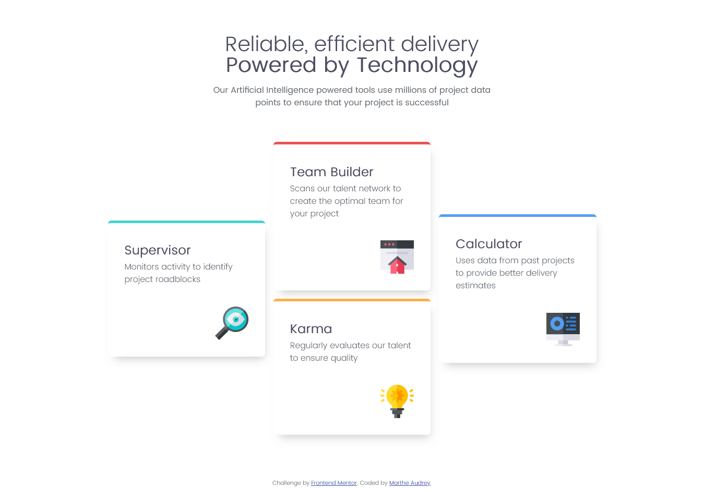

# Frontend Mentor - Four card feature section solution

This is a solution to the [Four card feature section challenge on Frontend Mentor](https://www.frontendmentor.io/challenges/four-card-feature-section-weK1eFYK). Frontend Mentor challenges help you improve your coding skills by building realistic projects. 

## Table of contents

- [Overview](#overview)
  - [The challenge](#the-challenge)
  - [Screenshot](#screenshot)
  - [Links](#links)
- [My process](#my-process)
  - [Built with](#built-with)
  - [What I learned](#what-i-learned)
  - [Continued development](#continued-development)
  - [Useful resources](#useful-resources)
- [Author](#author)
- [Acknowledgments](#acknowledgments)

**Note: Delete this note and update the table of contents based on what sections you keep.**

## Overview

### The challenge

Users should be able to:

- View the optimal layout for the site depending on their device's screen size

### Screenshot



### Links

- Solution URL: [Git Repository](https://github.com/MartheAudrey/Four-card-feature.git)
- Live Site URL: [Add live site URL here](https://your-live-site-url.com)

## My process

### Built with

- Semantic HTML5 markup
- CSS custom properties
- Flexbox
- CSS Grid


### What I learned

I learned how to give to all my flex elements the same width using the flex property.

```css
.layout-grid > *{
    flex: 1;
}
```

### Continued development

I would like to continue to learn CSS, how to write sustainable CSS code and good practices.


### Useful resources

- [Responsive layout - Kevin Powell](https://www.youtube.com/watch?v=JFbxl_VmIx0) - This helped me to organize my container using flexbox method.

## Author

- Frontend Mentor - [MartheA_19](https://www.frontendmentor.io/profile/MartheAudrey)

## Acknowledgments

Kevin Powell for his very instructive tutorials.
